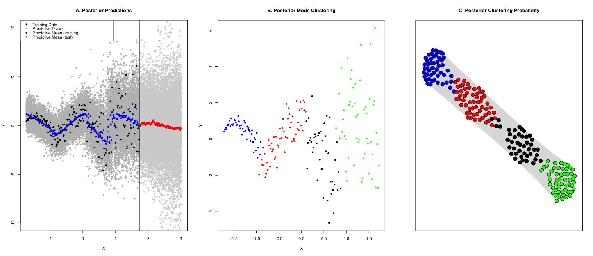

# Summary and Innovation
Regression modeling and clustering are common statistical tasks in biomedical research. However, regression problems often involve parametric assumptions (e.g. Normality). Clustering often involves pre-specifying the number of clusters - a quantity typically unknown to the researcher. Flexible machine learning methods do exist for such problems, but they tend to focus on point estimation rather than interval estimation. The latter is often just as important as the former in biomedical settings. There is great need for regression methods that do not make rigid parametric assumptions and clustering methods that do not require pre-specifying the number of clusters. It would also be ideal for these methods to produce uncertainty estimates that allow for valid statistical inference in addition to predictions.

`ChiRP` package implements **Chi**nese **R**estaurant **P**rocess (CRP) mixtures in `R`. CRP mixtures are a flexible class of Bayesian nonparametric models that can be used for general regression modeling and clustering problems that meets the needs mentioned above. 

At a high level, the model works by partitioning a complex, heterogenous dataset into more homogenous clusters - each associated with a locally parametric regression model. Unlike traditional clustering procedures, CRP mixtures allow for infinitely many clusters - thus removing the need to specify the number of clusters in advance. The CRP clustering also allows us to train nonparametric regressions that generate testing and training predictions by ensembling over the local cluster-specific regression models. Probabilistically valid interval estimates are also given for each prediction. We note that while the local cluster-specific models are parametric, allowing for infinitely many clusters yields an infinite-dimensional parameter space.

# Outcome Types and Model Output

We may be given a training dataset with $n$ subjects $D_T=(Y_i, X_i)_{i=1:n}$. Here, $Y_i$ is the scalar outcome/label and $X_i$ is a $p\times1$ feature vector.`ChiRP` trains a fully Bayesian CRP model with Monte Carlo Markov Chain (MCMC) and yields the following output:

1. In-sample predictions $( \hat{Y}_{i} )_{i=1:n}$ from a nonparametric CPR regression of $Y$ on $X$.
2. Out-of-sample predictions on an unlabeled test set $(\tilde{X}_i)_{1:m}$, $(\hat{\tilde{Y}}_i)_{i=1:m}$.
3. Latel cluster membership for both training and testing subjects.

`ChiRP`'s implementation is fully Bayesian - yielding not only point predictions, but interval estimtes that allow us to measure uncertainty around these predictions. Uncertainty estimation is often just as important, if not more important, than point estimation in biomedical sciences. 

`ChiRP` implements three different local cluster-specific regressions depending on the nature of $Y_i$: 

1. Continuous outcomes using cluster-specific linear regressions.
2. Binary outcomes using cluster-specific logistic regressions.
3. Zero-inflated, semi-continuous outcomes using cluster-specific zero-inflated regressions. [See @Oganisian2018]

# Simulated Example
The figure illustrates a CRP mixture of linear regressions using outcome data generated from a sine wave. The first panel shows a flexible mean outcome prediction in blue for in-sample data. Mean outcome prediction for the test set is shown in red. We plot 100 predictive draws for each $X$ to display the uncertainty around the mean outcome prediction.

Panel B gives some intuition about why a locally linear regression works so well with such complex data. The CRP model induces a clustering of points that are similar to each other in terms the linear model. Thus, the points are partitioned into four clusters - each with its own linear regression. These clusters are indicated by color. Predictions are generated by averaging predictions from these cluster-specific models. For this model, we initialized the CRP mixture with 10 clusters - but it settles on five.

Panel C represents each point in the training set as a node in a graph. The line connecting any two points is inversely proportional to the posterior probability of two subjects being clustered together, or "connected". Colors indicate the posterior mode assignment. For example, the blue and gray points are almost never clustered together. From Panel B it's obvious why this is: the blue and green points are far apart in $(X,Y)$ space. Note that some black points in Panel C are very close to the red points. This indicates that cluster assignment for these subjects are highly uncertain. They could belong to the red group or black group with significant probability.

# References
